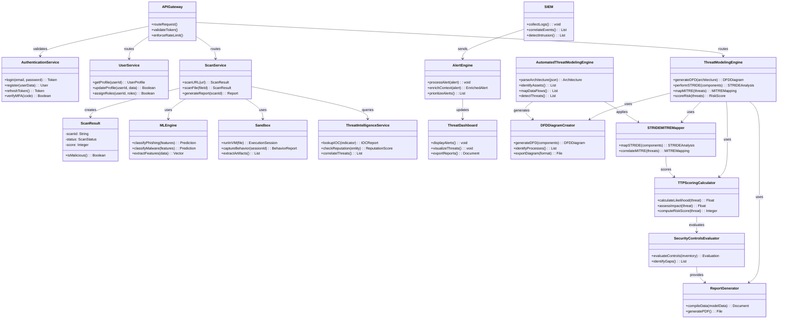

# Simplified Class Diagram

```mermaid
classDiagram
    %% ============================================
    %% API ENGINE
    %% ============================================
    class APIGateway {
        +routeRequest()
        +validateToken()
        +enforceRateLimit()
    }
    
    class AuthenticationService {
        +login(email, password): Token
        +register(userData): User
        +refreshToken(): Token
        +verifyMFA(code): Boolean
    }

    %% ============================================
    %% BACKEND SERVICES
    %% ============================================
    class UserService {
        +getProfile(userId): UserProfile
        +updateProfile(userId, data): Boolean
        +assignRoles(userId, roles): Boolean
    }
    
    class ScanService {
        +scanURL(url): ScanResult
        +scanFile(fileId): ScanResult
        +generateReport(scanId): Report
    }
    
    class ScanResult {
        -scanId: String
        -status: ScanStatus
        -score: Integer
        +isMalicious(): Boolean
    }
    
    class MLEngine {
        +classifyPhishing(features): Prediction
        +classifyMalware(features): Prediction
        +extractFeatures(data): Vector
    }
    
    class Sandbox {
        +runInVM(file): ExecutionSession
        +captureBehavior(sessionId): BehaviorReport
        +extractArtifacts(): List
    }
    
    class ThreatIntelligenceService {
        +lookupIOC(indicator): IOCReport
        +checkReputation(entity): ReputationScore
        +correlateThreats(): List
    }
    
    class ThreatModelingEngine {
        +generateDFD(architecture): DFDDiagram
        +performSTRIDE(components): STRIDEAnalysis
        +mapMITRE(threats): MITREMapping
        +scoreRisk(threats): RiskScore
    }

    %% ============================================
    %% MONITORING
    %% ============================================
    class SIEM {
        +collectLogs(): void
        +correlateEvents(): List
        +detectIntrusion(): List
    }
    
    class AlertEngine {
        +processAlert(alert): void
        +enrichContext(alert): EnrichedAlert
        +prioritizeAlerts(): List
    }
    
    class ThreatDashboard {
        +displayAlerts(): void
        +visualizeThreats(): void
        +exportReports(): Document
    }

    %% ============================================
    %% TIBSA CORE
    %% ============================================
    class AutomatedThreatModelingEngine {
        +parseArchitecture(json): Architecture
        +identifyAssets(): List
        +mapDataFlows(): List
        +detectThreats(): List
    }
    
    class DFDDiagramCreator {
        +generateDFD(components): DFDDiagram
        +identifyProcesses(): List
        +exportDiagram(format): File
    }
    
    class STRIDEMITREMapper {
        +mapSTRIDE(components): STRIDEAnalysis
        +correlateMITRE(threats): MITREMapping
    }
    
    class TTPScoringCalculator {
        +calculateLikelihood(threat): Float
        +assessImpact(threat): Float
        +computeRiskScore(threat): Integer
    }
    
    class SecurityControlsEvaluator {
        +evaluateControls(inventory): Evaluation
        +identifyGaps(): List
    }
    
    class ReportGenerator {
        +compileData(modelData): Document
        +generatePDF(): File
    }

    %% ============================================
    %% RELATIONSHIPS
    %% ============================================
    APIGateway --> AuthenticationService : validates
    APIGateway --> UserService : routes
    APIGateway --> ScanService : routes
    APIGateway --> ThreatModelingEngine : routes
    
    ScanService --> MLEngine : uses
    ScanService --> Sandbox : uses
    ScanService --> ThreatIntelligenceService : queries
    ScanService --> ScanResult : creates
    
    ThreatModelingEngine --> DFDDiagramCreator : uses
    ThreatModelingEngine --> STRIDEMITREMapper : uses
    ThreatModelingEngine --> TTPScoringCalculator : uses
    ThreatModelingEngine --> ReportGenerator : uses
    
    SIEM --> AlertEngine : sends
    AlertEngine --> ThreatDashboard : updates
    
    AutomatedThreatModelingEngine --> DFDDiagramCreator : generates
    AutomatedThreatModelingEngine --> STRIDEMITREMapper : applies
    STRIDEMITREMapper --> TTPScoringCalculator : scores
    TTPScoringCalculator --> SecurityControlsEvaluator : evaluates
    SecurityControlsEvaluator --> ReportGenerator : provides
```
