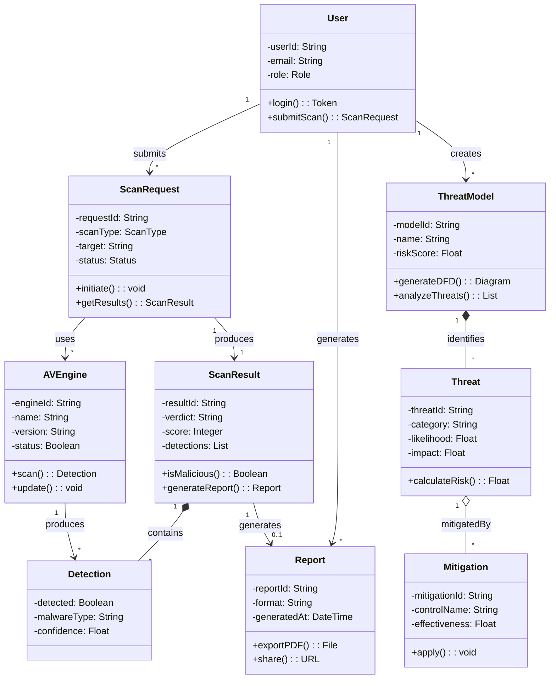

# Simplified Class Diagram

```mermaid
classDiagram
    %% ============================================
    %% CORE CLASSES
    %% ============================================
    
    class User {
        -userId: String
        -email: String
        -role: Role
        +login(): Token
        +submitScan(): ScanRequest
    }

    class ScanRequest {
        -requestId: String
        -scanType: ScanType
        -target: String
        -status: Status
        +initiate(): void
        +getResults(): ScanResult
    }

    class ScanResult {
        -resultId: String
        -verdict: String
        -score: Integer
        -detections: List
        +isMalicious(): Boolean
        +generateReport(): Report
    }

    class Report {
        -reportId: String
        -format: String
        -generatedAt: DateTime
        +exportPDF(): File
        +share(): URL
    }

    class ThreatModel {
        -modelId: String
        -name: String
        -riskScore: Float
        +generateDFD(): Diagram
        +analyzeThreats(): List
    }

    class Threat {
        -threatId: String
        -category: String
        -likelihood: Float
        -impact: Float
        +calculateRisk(): Float
    }

    class Mitigation {
        -mitigationId: String
        -controlName: String
        -effectiveness: Float
        +apply(): void
    }

    class AVEngine {
        -engineId: String
        -name: String
        -version: String
        -status: Boolean
        +scan(): Detection
        +update(): void
    }

    class Detection {
        -detected: Boolean
        -malwareType: String
        -confidence: Float
    }

    %% ============================================
    %% RELATIONSHIPS
    %% ============================================
    
    %% User relationships
    User "1" --> "*" ScanRequest : submits
    User "1" --> "*" ThreatModel : creates
    User "1" --> "*" Report : generates

    %% Scan flow
    ScanRequest "1" --> "1" ScanResult : produces
    ScanRequest "*" --> "*" AVEngine : uses
    ScanResult "1" *-- "*" Detection : contains
    ScanResult "1" --> "0..1" Report : generates

    %% Threat modeling
    ThreatModel "1" *-- "*" Threat : identifies
    Threat "1" o-- "*" Mitigation : mitigatedBy
    
    %% AV Engine
    AVEngine "1" --> "*" Detection : produces
```
